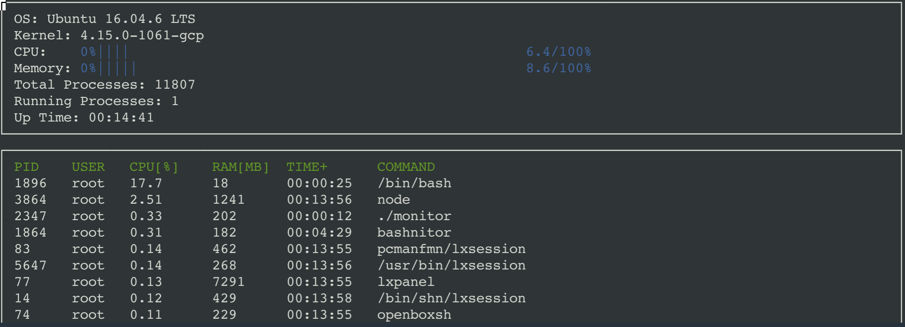
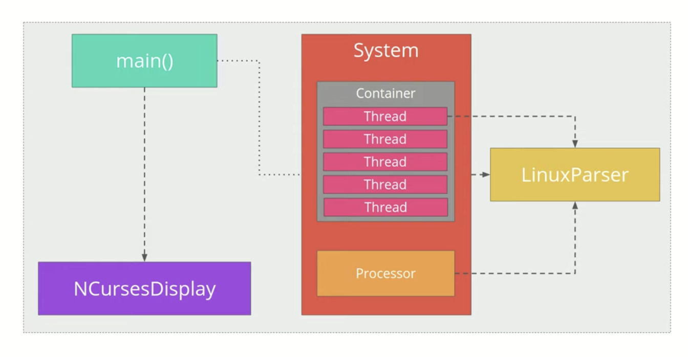

# Linux-System-Monitor

Implementation of a htop-like linux system monitor from the [Udacity C++ Nanodegree Program](https://www.udacity.com/course/c-plus-plus-nanodegree--nd213). 

## Features
* A terminal application that monitors and displays the states of the system processor and individual running processes
* CPU utilization are calculated dynamically, based on recent utilization
* Processes are sorted based on CPU utilization

## Project Instructure

### ncurses
This project relies on ncurses for display output. [ncurses](https://www.gnu.org/software/ncurses/) is a library that facilitates text-based graphical output in the terminal. 

To install ncurses within your own Linux environment: `sudo apt install libncurses5-dev libncursesw5-dev`

### Linux Parser
A namespace that contains functions that parse linux system data

## Build Instructions
This project uses [Make](https://www.gnu.org/software/make/). The Makefile has four targets:
* `build` compiles the source code and generates an executable
* `format` applies [ClangFormat](https://clang.llvm.org/docs/ClangFormat.html) to style the source code
* `debug` compiles the source code and generates an executable, including debugging symbols
* `clean` deletes the `build/` directory, including all of the build artifacts
